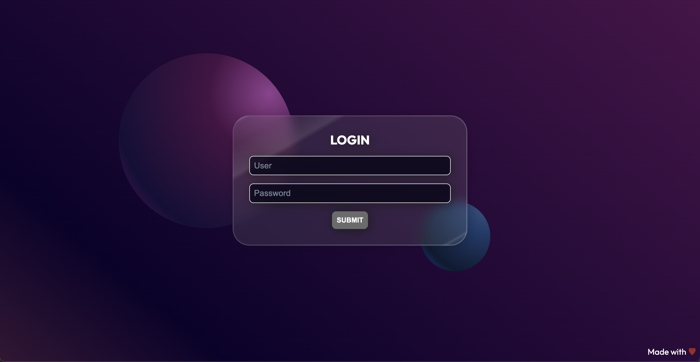

# CSS Advanced - Glassmorphism Login 

In this article, we will explore how to creatively use some basic CSS rules and add a touch of advanced properties to achieve some _special_ effects.





**Required Knowledge:**

1. Box-model
2. States: :focus, :hover
3. Animations with @keyframes
4. Position Absolute
5. Media query

**We will cover:**

1. Custom properties
2. Logical properties
3. Linear and radial gradients
4. Pseudo-elements like ::before and ::after.
5. Utilizing advanced CSS properties such as mask, mask-composite, backdrop-filter...
6. Input states
7. Media query prefers-reduced-motion and prefers-color-scheme

In this layout, we will not use Flex but instead focus primarily on working with position absolute.

## Let's start with the HTML
```HTML
<!DOCTYPE html>
<html lang="en">

<head>
  <meta charset="UTF-8">
  <meta http-equiv="X-UA-Compatible" content="IE=edge">
  <meta name="viewport" content="width=device-width, initial-scale=1.0">

  <!-- google fonts -->
  <link rel="preconnect" href="https://fonts.googleapis.com">
  <link rel="preconnect" href="https://fonts.gstatic.com" crossorigin>
  <link href="https://fonts.googleapis.com/css2?family=Outfit:wght@400;700&display=swap" rel="stylesheet">

  <!-- our style -->
  <link rel="stylesheet" href="css/style.css">
  <title>Glassmorph Login</title>
</head>

<body>

  <div class="overlay">
    <section class="card">
      <h1 class="card__title">Login</h1>

      <form action="" id="login" class="card__form">
        <div class="row">
          <input type="text" name="user" id="user" placeholder="User">
          <label for="user">User</label>
        </div>

        <div class="row">
          <input type="password" name="password" id="password" placeholder="Password">
          <label for="password">Password</label>
        </div>

        <button class="btn" type="submit">Submit</button>
      </form>
      
    </section>

    <footer class="overlay__copy">
      <span>Made with</span> <span class="red">&hearts;</span>
    </footer>
  </div>

</body>

</html>
```


The layout is very straightforward. We have an overlay that serves as the background and contains the card. 


A central card positioned absolutely relative to the overlay.


A footer positioned absolutely at the bottom right relative to the overlay.


Each `input` is associated with a `label` that starts hidden and only animates when the input is in focus, then remains visible if we enter text into the input. We will reduce the speed of this animation in case the "reduce motion" setting is chosen.


The two spheres are created directly with CSS using `::before` and `::after` along with a gradient.


**As you can see, the card has a translucent effect in a Glassmorphism style.**


For class naming, I usually adhere to [BEM (Block, Element, Modifier)](https://en.bem.info/methodology/).

When writing HTML, I always strive to find the most suitable semantic tag for the case. While it's not always easy, in this instance, we have a few tags. <br> A `div` for the overlay, which doesn't have a specific meaning but contains the other elements, a `section` representing the login card, and a `footer`. <br>
Within the section, there's a title, a `form` containing rows (`div`), `input` and associated `label`, and a `button` to submit the form.

Always remember that HTML should convey meaning, and by choosing appropriate tags, your work on accessibility and SEO will benefit. Like in any language, there are nuances in HTML that become clearer and easier to identify over time. However, when in doubt about whether a tag fits your purpose or if there's no equivalent for what you want to express, I recommend using the [HTML validator](https://validator.w3.org/) and exploring the [available elements](https://developer.mozilla.org/en-US/docs/Web/HTML/Element#content_sectioning). I assure you that every time I revisit them, I find something interesting to use.
## CSS
After this necessary preamble, if you've made it this far, you're likely wondering how to use CSS to create unique designs and make the designers who envisioned them happy. Glassmorphism is a highly captivating style. While it might be less trendy today compared to Brutalism, it provides an excellent opportunity to explore some advanced CSS rules.

For further insights and inspiration on Glassmorphism, you can refer to the [UXdesign.cc Glassmorphism Article](https://uxdesign.cc/glassmorphism-in-user-interfaces-1f39bb1308c9).

**Let's start!**
### 1. Custom properties
For some years now, CSS has also adopted its own variable system, dethroning SASS from its pedestal (though there are other interesting aspects of SASS that I usually use).
#### So, what are custom properties all about?

We choose a name and store values in it that we will reuse in our CSS! I find them particularly useful for saving colors, dimensions, and calculations.

We can save variables at the `:root` selector level or any other selector.

```CSS
:root {
  --bodyColor: rgb(255 255 255);
}
```
Custom properties must always begin with `--`.

To use a custom property, we need to use the `var()` function and pass it the name of the variable.

```CSS
body {
  color: var(--bodyColor)
}
```

Once custom properties are set in the root, we can modify their values within media queries or for a specific state of an element, without altering the original element.

Let's begin with the initial set of variables we will use, along with an example of how to override them in a media query. I typically place colors at the top and reuse them within variables named with a more semantic label.

```CSS
:root {
  color-scheme: light dark;
  --blue: rgb(56 89 132);
  --red: rgb(157 41 41);
  --gray: rgb(91, 93, 95);
  --lightGray: rgb(202, 209, 218);
  --grayDark: rgb(84, 84, 84);

  --bodyColor: white;
  --heartColorColor: var(--red);
  --inputColor: var(--gray);
  --inputBorder: 1px solid transparent;
  --inputBorderFocus: white;
  --inputBoxFocus: var(--blue);
  --inputBg: white;
  --labelColor: var(--blue);
  --labelLetterSpacing: normal;
  --labelFontWeight: normal;
  --btnHoverBg: var(--blue);
  --btnBorderHover: white;
  --btnColor: white;
}

@media (prefers-color-scheme: dark) {
  :root {
    --btnPlaceholderColor: white;
    --labelColor: white;
    --inputColor: var(--lightGray);
    --inputBorder: 1px solid white;
    --inputBorderFocus: white;
    --inputBg: var(--grayDark);
    --labelLetterSpacing:  0.05rem;
    --labelFontWeight: bold; 
  }
}
```

As you can see, the variable name remains unchanged, and we modify its value within a given media query.

Here, we encounter a specific media query for the first time. Instead of testing the viewport size, we are checking the user's color scheme preference! 

`color-scheme: light dark;` allows us to determine which schemes are enabled.

`prefers-color-scheme: dark` will intercept the user's settings, which we can use to adjust the colors based on their preference.

[color-scheme MDN Reference](https://developer.mozilla.org/en-US/docs/Web/CSS/color-scheme)

[prefers-color-scheme MDN Reference](https://developer.mozilla.org/en-US/docs/Web/CSS/@media/prefers-color-scheme)

_I chose to increase the letter spacing of labels in dark mode to enhance text readability in this mode._

Here's the first part of the CSS where I set the font size, font-family, and text color values using the previously created variable.

```CSS
/* common */
html {
  font-family: 'Outfit', sans-serif;
  font-size: 100%;
  color: var(--bodyColor)
}

.red {
  color: var(--heartColor)
}
```

#### Why `font-size: 100%;`?

I use this precaution to ensure that the base font size is the same as the one set by the user in their preferences. We will then use almost all measurements in `rem` so that they scale consistently with the user's choices. For accessibility, it's necessary to allow users to resize text up to 200%. Accessibility doesn't necessarily mean making our design less appealing but being mindful of meeting the needs of the broadest audience possible. Sometimes, a few small precautions make a significant difference.

### 2. Logical Properties

Logical properties allow us to establish the dimensions of elements not based on physical directions (top, bottom, right, left) but rather on the logical usage.

Let's see what this means in practice. 
Typically, if we want to give margins to an element, we would do it like this:

```SCSS
.box {
  margin: 1rem 2rem; //1rem sopra sotto, 2rem destra sinistra
}
```

With logical properties, we can write it like this.

```CSS
.box {
  margin-block: 1rem;
  margin-inline: 2rem;
}
```

#### **What Changes with Logical Properties?**

Thanks to the definitions of **block** and **inline**, we can establish margins based on the positioning that elements can have in relation to the reading flow. So, if we decide to change the reading direction from top-bottom/left-right, as we are used to in the Italian language, to bottom-top/right-left, our entire layout will adjust accordingly.


Here's a definition of block and inline size:

**Block Size** The dimension perpendicular to the flow of the text within a line, i.e., the vertical dimension in horizontal writing modes, and the horizontal dimension in vertical writing modes. For standard English text, it's the vertical dimension.

**Inline Size** The dimension parallel to the flow of the text within a line, i.e., the horizontal dimension in horizontal writing modes, and the vertical dimension in vertical writing modes. For standard English text, it's the horizontal dimension.

By modifying our CSS as follows, incorporating the `writing-mode`:

```CSS
html {
  font-family: 'Outfit', sans-serif;
  font-size: 100%;
  color: var(--bodyColor);
  writing-mode: vertical-lr;
}
```

We will achieve a rotation of the layout (note that not all browsers implement this behavior correctly; for example, Chrome does not rotate inputs correctly).


This image was created using Firefox.

_Disclaimer: We cannot fully leverage this feature yet due to implementation limitations, but the new syntax also has the advantage of being similar to that of Flex and Grid._
[W3 CSS Logical Properties and Values Level Reference](https://www.w3.org/TR/css-logical-1/)


Let's then add to our CSS the styling for the `h1` and the `div.overlay`.

```SCSS
/* common */
html {
  font-family: 'Outfit', sans-serif;
  font-size: 100%;
  color: var(--bodyColor)
}

.red {
  color: var(--heartColor)
}

/* typography */
h1 {
  margin-block-end: 1rem; //equivale a margine inferiore
  text-transform: uppercase;
}

/* layout */
.overlay {
  position: relative;
  inline-size: 100%; //larghezza
  block-size: 100vh; //altezza
  background: var(--overlayBg); 
} 
```

### 3. Pseudo-elements: Let's Create the Spheres.

Now, we get into the fun part!

We'll create the two spheres using only CSS. Since they are decorative and don't hold any semantic meaning, we can make them without adding extra elements to our DOM. In the case where the background has semantic importance, then we should create them with tags. The purpose of our exercise is, of course, to use pseudo-elements.

All selectors in CSS that start with `::` indicate a pseudo-element, essentially creating an element in the DOM.

In this case, we'll use `::before` and `::after`, the first to create the left sphere and the second for the right one.

#### `::before`

Generates an element within our selector, for example, `.overlay::before`, before the content of the tag.

#### `::after`

Generates an element within our selector, for example, `.overlay::after`, after the content of the tag.


As you can see in the image, in the inspector, we have:

```HTML
<div class="overlay">
  ::before
  <section class="card">
  </section>

  <footer class="overlay__copy">
  </footer>
  ::after
</div>
```

Here is the complete code for the two spheres.

```CSS
.overlay::before {
  content: '';
  display: block;
  position: absolute;
  z-index: 0;
  inset-block-start: 15%;
  inset-inline-start:  17%;
  inline-size: 25vw;
  block-size: 25vw;
  border-radius: 100%;
  background: var(--overlayBeforeBg);
}
.overlay::after {
  content: '';
  display: block;
  position: absolute;
  z-index: 0;
  inset-block-end:  25%;
  inset-inline-end:  30%;
  inline-size: 10vw;
  block-size: 10vw;
  border-radius: 100%;
  background: var(--overlayAfterBg);
}
```

Let's analyze the new properties.

```CSS
.overlay::after {
  content: '';
  display: block;
}
```

These two rules are necessary to display the generated element. The `content` can even be empty, but we must explicitly declare it. Similarly, the `display` property is crucial; otherwise, the element won't be visible.

In our case, it's not necessary to include `display` because when we use `position: absolute`, the element automatically becomes a block.

If we look at the computed properties, we'll see that `display: block` has a desaturated color, indicating an inherited rule.


####  Inset: Positioning Elements in a "Logical" Manner.

Let's analyze the next rules.

```CSS
{
 position: absolute;
 z-index: 0;
 inset-block-start: 15%;
 inset-inline-start:  17%;
}
```

We have an `absolute` position and a `z-index`; the elements are positioned relative to `.overlay`, which indeed has a `position: relative`.

Then, we have two new rules: `inset-block-start` and `inset-inline-start`.

The `inset` rule is a shorthand for `top right bottom left`.

```CSS
{
  inset: 2.4rem 3rem 3rem 3rem; /* top right bottom left */
}
```

Starting from this shorthand, logical properties have added suffixes indicating whether we are working in block or inline, start or end (which are identical to the positions in Flex and Grid).

- `inset-block-start` corresponds to `top`
- `inset-block-end` corresponds to `bottom`
- `inset-inline-start` corresponds to `left`
- `inset-inline-end` corresponds to `right`

_With these rules, changing the reading direction adjusts our positioning accordingly._

### 3. Linear e radial gradient
And now, let's delve into the magic of color.

For the overlay, we have a linear gradient.

```CSS
:root {
 --overlayBg: linear-gradient(-140deg, 
                           rgb(74 16 74), 
                           rgb(13 1 43) 80%, 
                           rgb(53 21 53)); 
}
```

  
Let's analyze the `linear-gradient()` function.

The first parameter is the direction, in our case, `-140deg`, and from the second one onward, we insert our colors. If we place numbers next to the colors, we are explicitly specifying the position from which it starts and ends.

Always check the inspector to see how the gradient is displayed.


Chrome shows us a clock to adjust the gradient angle, and we can also modify the colors and the stop position, immediately seeing a different result.

Let's see, for example, what happens if we remove that 80%.

This is the original gradient.


This is the modified one.


By removing that 80%, the colors positioned themselves at equal distances, creating a more centered gradient. However, we want the darker part to be more shifted towards the bottom-left.

Let's also take a look at the magical clock.


Rotating the hand, we can see the changes both within the clock itself and in the viewport.

#### Creating Spheres with Radial Gradient
```CSS
:root {/* circle is the shape of gradient at position left top */
  --overlayBeforeBg: radial-gradient(circle at 86% 23%,  
                                    rgb(157 68 152  / 0.9) 0%, 
                                    rgb(74 18 69 / 0.9) 30%, 
                                    rgba(22 15 56 / 0.9) 77%, 
                                    rgba(165 12 150 / 0.577) 100%);
  --overlayAfterBg: radial-gradient( circle at 95% 6%, 
                                    rgb(56 89 132 / 0.9) 0%,
                                    rgb(27 63 111  / 0.9) 30%, 
                                    rgb(11 27 48  / 0.9) 77%, 
                                    rgb(8 73 157  / 0.9) 100%);}
```

Here, things might seem more intricate, but only at first glance.

The first parameter of the `radial-gradient()` function is the center positioning and the final shape `<ending-shape>`. The default final shape is elliptical, and we make it circular. Then, we move the center with `at 86% 23%`. 
`86%` is the position from left to right, `23%` from top to bottom.

From the second argument onward, we have colors and their respective stops, as always.

To achieve the right spherical effect, we need to remember to fix a point where the light is strongest, which is our center, and then insert a softer light from the opposite side.


The gradient of the overlay helps to separate the sphere from the background, creating a sense of depth.

Do you need a hand with gradients? <br>
There are many generators you could try, for example,
[cssgradient.io](https://cssgradient.io/)

### 4. Creating the Translucent Card Effect.

Let's start with the base of the card. We'll create a background with a gradient that simulates both a glossy and transparent effect. Then, we'll add a **blur** effect.

```SCSS
:root {
   --cardBg: linear-gradient(150deg, 
                            rgb(255 255 255 / 0.1), 
                            rgb(255 255 255 / 0.1) 2%, 
                            rgb(255 255 255 / 0.2) 3%, 
                            rgb(255 255 255 / 0.1) 4%, 
                            rgb(255 255 255 / 0.1) 12%, 
                            rgb(255 255 255 / 0.2) 23%, 
                            rgb(255 255 255 / 0.1) 25%, 
                            rgb(255 255 255 / 0.1) 94%, 
                            rgb(255 255 255 / 0.2) 95%, 
                            rgb(255 255 255 / 0.1) 96%);
}
```

We have a linear gradient with a degree of 150deg, and all `rgb` colors have an opacity, indicated by the number after the `/`.

As mentioned earlier, percentages represent the stop positions.

Here, to create the glossy effect, it's necessary to create closely positioned stops. We create the brightest effect in the top-left corner to make the card stand out against the dark background while keeping the inputs clearly visible.


```SCSS
.card {
  position: absolute;
  inset-block-start: 50%;
  inset-inline-start:  50%;
  z-index: 1;
  transform: translate(-50%, -50%);
  inline-size: 50%;
  min-inline-size: 18.75rem; //esistono ovviamente anche min e max size
  max-inline-size: 28.125rem;
  padding: 2rem;
  border-radius: 2rem;
  background: var(--cardBg) border-box; 
  filter: drop-shadow(2px 2px 10px rgb(0 0 0));
  backdrop-filter: blur(10px);
  text-align: center;
}
```

The rule `filter: drop-shadow(2px 2px 10px rgb(0 0 0));` creates a shadow under the card, while `backdrop-filter: blur(10px);` creates the blur effect on the elements behind the card.

To make the effect more realistic, we need to add a lighter reflection around the card, and a simple `border` wouldn't work because we need a gradient that tends towards white in the bottom right and towards purple in the top left.

**Here, we need to get creative!**

This is the basic code: a `before` with absolute positioning and `z-index: -1` to place it behind `.card`, a `padding` of `2px` to make it larger, and a linear gradient.

```CSS
.card::before {
  content: '';
  position: absolute;
  z-index: -1;
  inset: 0;
  padding: 2px; 
  background: var(--cardBeforeBG); 
  border-radius: 2rem; 
}
```

```CSS
:root {
  --cardBeforeBG: linear-gradient(-45deg,
                                  rgb(255 255 255 / 0.2) 5%, 
                                  rgb(255 255 255 / 0.2) 30%,
                                  rgb(193 73 197 / 0.2));
```

Here is the result:


Now we need to eliminate the central part.

We'll use the `mask` and `mask-composite` properties.

`Mask` allows us to insert an element that acts as a mask for our `::before`, hiding a part of it. This property accepts images, SVGs, and even gradients as values. In our case, we use two gradients with different clips.

```CSS
{
  mask-image: linear-gradient(#fff 0 0), linear-gradient(#fff 0 0);
  mask-clip: padding-box, content-box;
  -webkit-mask-image: linear-gradient(#fff 0 0), linear-gradient(#fff 0 0);
  -webkit-mask-clip: padding-box, content-box;
}
```

By using these two mask clips on top of each other, the first gradient starts from the border of the content.


While the second one starts from the border of the padding.


> content-box: The painted content is clipped to the content box.

> padding-box: The painted content is clipped to the padding box.

To these, we also add `mask-composite`.

```CSS
{
  mask-composite: exclude;  
  -webkit-mask-composite: xor;
}
```

`Mask-composite` establishes how overlapping elements behave. In our case, we want them to exclude each other.

Let's combine `mask-image` and `mask-clip` into a single custom property using the shorthand.

```CSS
:root {
  /* first gradient mask source and second gradient mask destination  */
  --cardMask: linear-gradient(white 0 0) padding-box, 
              linear-gradient(white 0 0) content-box;
}```

Here is the complete code:

```CSS
.card::before {
  content: '';
  position: absolute;
  z-index: -1;
  inset: 0;
  padding: 2px; 
  background: var(--cardBeforeBG); 
  border-radius: 2rem; 
  mask: var(--cardMask);
  mask-composite: exclude;  
  /* chrome */
  -webkit-mask: var(--cardMask);
  -webkit-mask-composite: xor;
}
```


[CSS Mask examples](https://www.w3schools.com/css/css3_masking.asp)
[CSS Mask reference](https://developer.mozilla.org/en-US/docs/Web/CSS/mask)
[CSS Mask Composite reference](https://developer.mozilla.org/en-US/docs/Web/CSS/-webkit-mask-composite )

### 6. Input States

Finally, let's move on to the input states!
 
```SCSS
.card__form .row {
  position: relative; 
  margin-block-end: 1rem;
  font-size: 1.5rem;
}

.card__form input {
  inline-size: 100%;
  padding-inline: 0.5rem;
  border: var(--inputBorder);
  border-radius: 0.5rem;
  background-color: var(--inputBg);
  line-height: 2.2rem;
  font-size: 1rem;  
  transition: padding 0.2s;
}
.card__form input::placeholder {
  color: var(--inputColor);
}
```

Let's set `position: relative` to position the `label` absolutely, and add a transition to the input that will enlarge it when the label appears.

We'll also style the `placeholder` using another pseudo-selector `::placeholder`.

When we enter focus, we want to increase the padding to make room for the label. Additionally, we want this size to remain active, as well as the label when we have entered text into the input.

```CSS
.card__form input:focus, 
.card__form input:not(:placeholder-shown) {
  padding-block: 0.8rem 0.1rem;
  outline: none;
}
.card__form input:focus{
  border: 2px solid var(--inputBorderFocus);
}
.card__form input:focus::placeholder {
  color: transparent;
}
@media screen and (prefers-color-scheme: light) {
  .card__form input:focus {
    outline: 2px solid var(--inputBoxFocus);
    outline-offset: -4px;
  }
}
```

To achieve this result, we use the selector `:not(:placeholder-shown)`, which targets all inputs that don't have the placeholder visible.

If we are in focus, we make the placeholders transparent since the label will be visible. Finally, for the light color scheme preference, we add a different focus style to the input.

Since our background is white, to make the focus border sufficiently contrasted, we create a double border, white and blue. <br>
`outline` is used to create a blue line, and `outline-offset` creates space between this line and the actual border.

Here is the result.


```CSS
.card__form label {
  position: absolute;
  display: none;
  font-size: 0.9rem;
  color: var(--labelColor);
}
.card__form input:focus + label,
.card__form input:not(:placeholder-shown) + label {
  display: block;
  inset-block-start: 0.3rem;
  inset-inline-start:  0.5rem; 
  font-weight: var(--labelFontWeight);
  letter-spacing: var(--labelLetterSpacing);
  animation-name: labelAnimation;
  animation-duration: 0.5s;
  animation-iteration-count: 1;
}
```

To animate the label, we use `position: absolute`. When we focus on the input, we add an `animation` that, once completed, should keep the last active state even when there is no placeholder visible anymore.

```CSS
.card__form input:focus + label,
.card__form input:not(:placeholder-shown) + label 
```

The `+` operator allows us to start from the focused input and select the next label.

The animation moves the positioning from the center of the input upwards and changes the display from none to block.

```CSS
@keyframes labelAnimation {
  0% {
    display: none;
    inset-block-start: 50%;
    transform: translate-Y(-50%);
  }
  100% {
    display: block;
    inset-block-start: 0.3rem;
    transform: translate-Y(0);
  } 
}
```

### 7. Prefers Reduced Motion

As we know, fast animations can create severe issues for some individuals. Therefore, it's possible to set a preference for reducing the speed of animations from the operating system. We can intercept this preference with a media query and increase the duration of the animation.

```CSS
@media screen and (prefers-reduced-motion: reduce) {
  .card__form input:focus + label,
  .card__form input:not(:placeholder-shown) + label {
    animation-duration: 1.5s;
  }
}
```
### 8. Button and Footer

Finally, let's address the button with hover and focus states, as well as the footer.

```CSS
.card__form .btn {
  padding-inline: 0.5rem;
  /* without border we have a layout shift */
  border: 1px solid transparent; 
  border-radius: 0.5rem;
  line-height: 2rem;
  font-weight: bold;
  text-transform: uppercase;
  cursor: pointer;
}
.card__form .btn:hover, 
.card__form .btn:focus {
  background-color: var(--btnHoverBg);
  border: 1px solid var(--btnBorderHover);
  outline: none;
  color: var(--btnColor);
}
```

On the button, we need to remember to include a transparent border of the same size as the colored border to prevent the button from growing when we hover, creating a layout shift!

### Conclusion

In this article, we've explored how to use various advanced CSS properties to create a layout that is simple in terms of HTML but complex in terms of visual effects. Some rules we've covered may not be fully supported by all browsers, so always check on [Can I Use](https://caniuse.com/) for their actual coverage in different browsers.

If you have any questions or requests for future topics, feel free to leave a comment or send me a message!