# Login CSS Advanced
In questo articolo vedremo come utilizzare alcune regole basilari di CSS in maniera creativa e aggiungeremo un pizzico di proprietà avanzate per realizzare qualche effetto *speciale*.


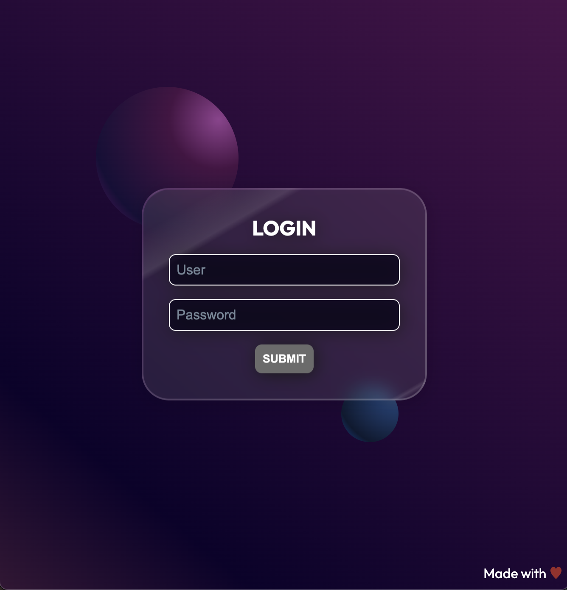


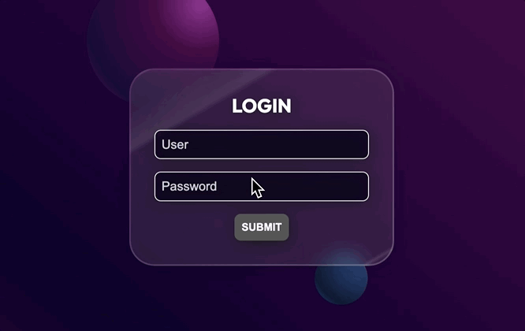


**Conoscenze necessarie:**
1. Box-model
3. Stati :focus, :hover
4. Animazioni con @keyframes 
5. Position Absolute
6. Media query 

**Vedremo:**
1. Custom properties
2. Logical properties
3. Linear e radial gradient
4. Pseudo-elementi come ::before e ::after.
5. Utilizzo di proprietà CSS avanzate come mask, mask-composite, backdrop-filter...
6. Stati degli input
7. Media query prefers-reduced-motion e prefers-color-scheme

In questo layout non faremo uso di Flex per lavorare principalmente con position absolute.

## Partiamo dall'HTML
```HTML
<!DOCTYPE html>
<html lang="en">

<head>
  <meta charset="UTF-8">
  <meta http-equiv="X-UA-Compatible" content="IE=edge">
  <meta name="viewport" content="width=device-width, initial-scale=1.0">

  <!-- google fonts -->
  <link rel="preconnect" href="https://fonts.googleapis.com">
  <link rel="preconnect" href="https://fonts.gstatic.com" crossorigin>
  <link href="https://fonts.googleapis.com/css2?family=Outfit:wght@400;700&display=swap" rel="stylesheet">

  <!-- our style -->
  <link rel="stylesheet" href="css/style.css">
  <title>Glassmorph Login</title>
</head>

<body>

  <div class="overlay">
    <section class="card">
      <h1 class="card__title">Login</h1>

      <form action="" id="login" class="card__form">
        <div class="row">
          <input type="text" name="user" id="user" placeholder="User">
          <label for="user">User</label>
        </div>

        <div class="row">
          <input type="password" name="password" id="password" placeholder="Password">
          <label for="password">Password</label>
        </div>

        <button class="btn" type="submit">Submit</button>
      </form>
      
    </section>

    <footer class="overlay__copy">
      <span>Made with</span> <span class="red">&hearts;</span>
    </footer>
  </div>

</body>

</html>
```


L'impaginazione è molto semplice.
Abbiamo un overlay che farà da sfondo e contiene la card. 
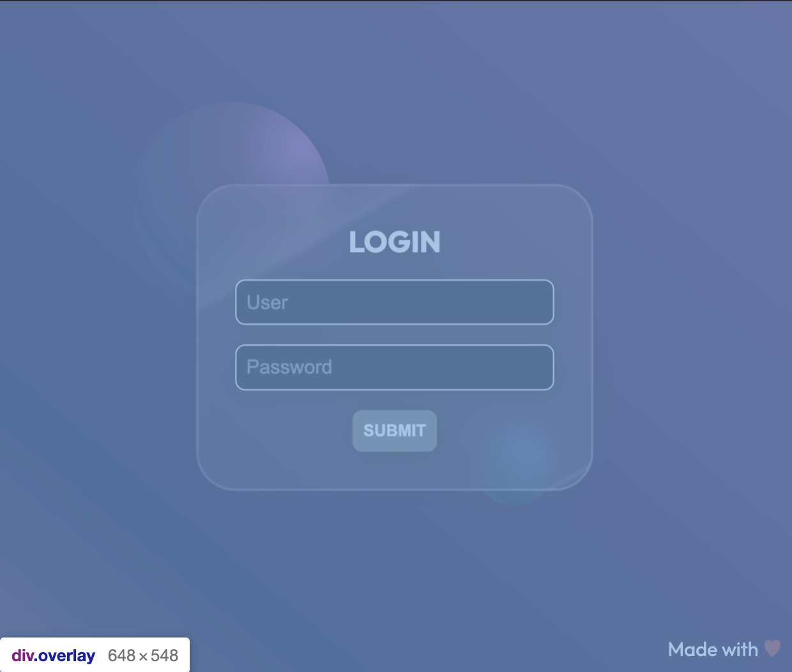

Una card centrale in posizionamento assoluto rispetto all'overlay.
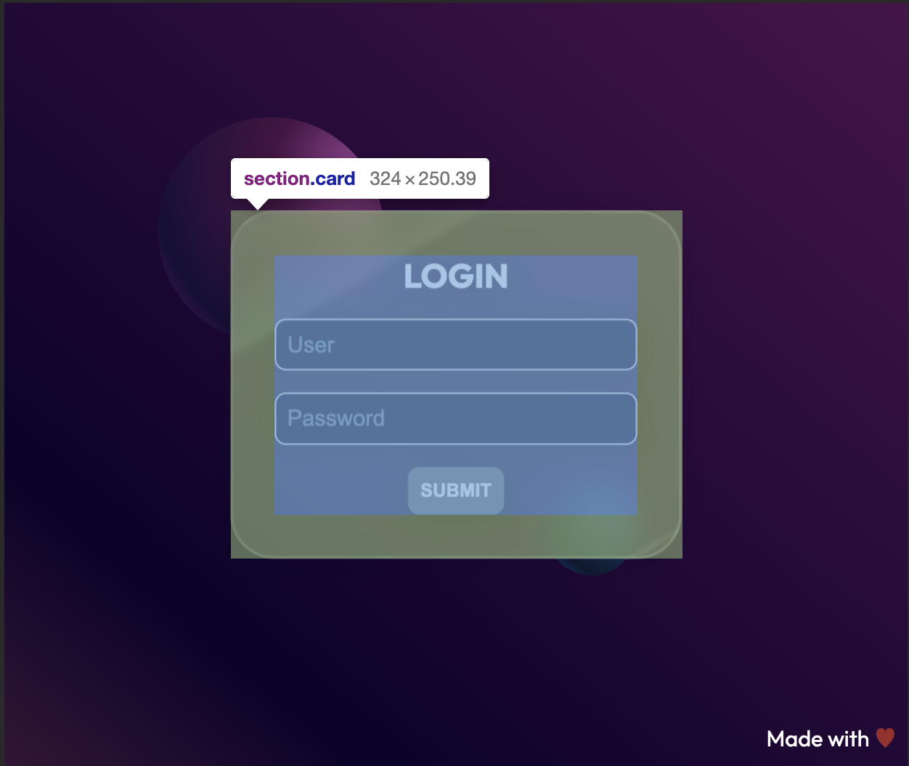

Un footer che sta in basso a destra in posizionamento assoluto rispetto all'overlay.
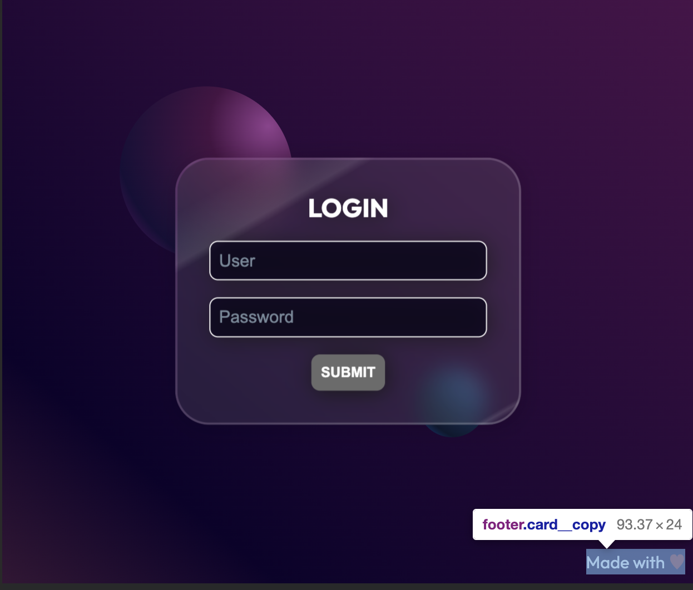

Ad ogni `input` è associata una `label` che parte nascosta e si anima solo quando andiamo in focus sull'input, per poi rimanere visibile se inseriamo del testo nell'input.
Ridurremo la velocità di questa animazione nel caso in cui si scelga l'impostazione "animazioni a velocità ridotta".


Le due sfere sono realizzate direttamente con CSS con un `::before` e un `::after` e un bel gradiente.


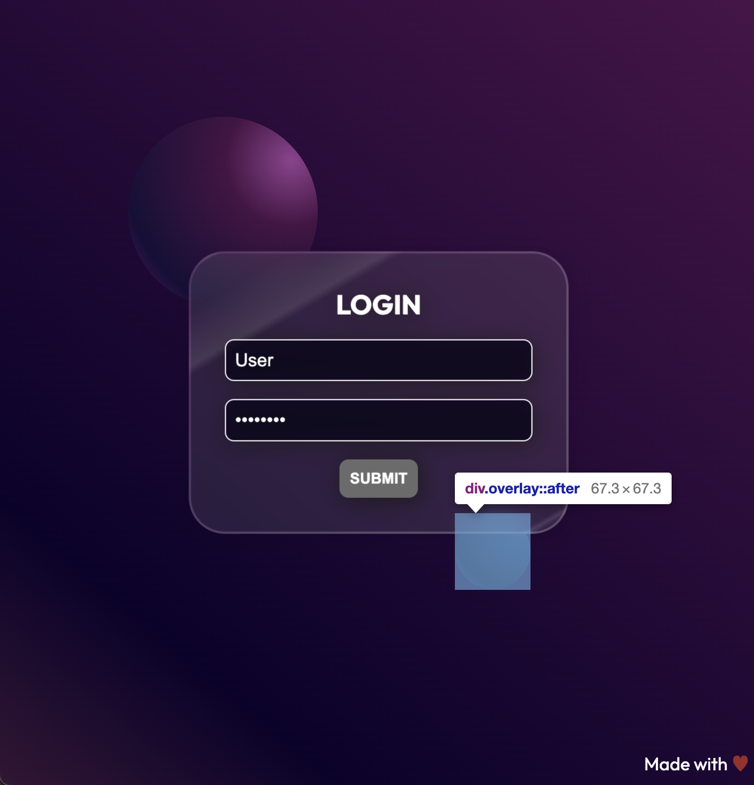

La card come potete vedere, ha un effetto traslucido in stile Glassmorphism.


Per il naming delle classi solitamente utilizzo [BEM](https://en.bem.info/methodology/).

Nella scrittura dell'HTML cerco sempre di trovare il tag semantico più adatto al caso, non è sempre facile, ma in questo caso abbiamo pochi tag. <br>
Un `div` per l'overlay che non ha un vero e proprio significato ma trattiene gli altri elementi, una `section` che rappresenta la card per la login, e un `footer`. <br>
Nella section un titolo, un `form` che ha al suo interno delle righe (`div`), `input` e `label` associata, un `button` per inviare il tutto.

Ricordiamo sempre che l'HTML deve innanzitutto significare qualcosa e se scegliamo bene i nostri tag anche il nostro lavoro sull'accessibilità e la SEO ne saranno avvantaggiati. Come in tutte le lingue esistono in HTML delle sfumature che con il tempo ci sembreranno più evidenti e facili da individuare, ma quando siamo in crisi perché non è chiaro se un tag faccia al caso nostro o se non esiste un equivalente di quel che vorremmo esprimere vi consiglio di utilizzare il [validator HTML](https://validator.w3.org/) e dare un'occhiata agli [elementi disponibili](https://developer.mozilla.org/en-US/docs/Web/HTML/Element#content_sectioning). Vi assicuro che ogni volta che li rileggo trovo qualcosa di interessante da utilizzare.

## CSS
E dopo questo dovuto preambolo eccoci nel vivo, se siete arrivati fin qui è perché vi state chiedendo come utilizzare CSS per creare design particolari, e fare contenti i designer che li hanno disegnati.
Il Glassmorphism è uno stile molto accattivante, oggi va sicuramente meno di moda del Brutalism, ma è un ottimo spunto per vedere alcune regole avanzate di CSS.

[UXdesign.cc Glassmorphism Article](https://uxdesign.cc/glassmorphism-in-user-interfaces-1f39bb1308c9)

**Let's start!**
### 1. Custom properties
Da qualche anno anche CSS si è dotato del suo sistema di variabili spodestando SASS dal suo piedistallo (ma ci sono altre cose interessanti di SASS che utilizzo solitamente). 
#### In che consistono quindi le custom properties?
Scegliamo un nome e ci salviamo dentro dei valori che riutilizzeremo nel nostro CSS!
Le trovo particolarmente utili per salvare colori, dimensioni e calcoli.

Possiamo salvare le variabili a livello del selettore `:root` o di un qualunque altro selettore.

```CSS
:root {
  --bodyColor: rgb(255 255 255);
}
```
Le custom properties devono iniziare sempre per `--`.

Per utilizzare una custom property dobbiamo usare la funzione `var()` e passarle il nome della variabile.

```CSS
body {
  color: var(--bodyColor)
}
```

Una volta inserite le custom properties nella root possiamo modificarne il valore nelle mediaquery, oppure per uno stato particolare di un elemento, senza toccare l'elemento di partenza. 

Partiamo con la prima parte di variabili che utilizzeremo, e un esempio di come sovrascriverle in una mediaquery.
Solitamente inserisco i colori in alto e poi li riutilizzo all'interno di variabili denominate con un nome più semantico.

```CSS
:root {
  color-scheme: light dark;
  --blue: rgb(56 89 132);
  --red: rgb(157 41 41);
  --gray: rgb(91, 93, 95);
  --lightGray: rgb(202, 209, 218);
  --grayDark: rgb(84, 84, 84);

  --bodyColor: white;
  --heartColorColor: var(--red);
  --inputColor: var(--gray);
  --inputBorder: 1px solid transparent;
  --inputBorderFocus: white;
  --inputBoxFocus: var(--blue);
  --inputBg: white;
  --labelColor: var(--blue);
  --labelLetterSpacing: normal;
  --labelFontWeight: normal;
  --btnHoverBg: var(--blue);
  --btnBorderHover: white;
  --btnColor: white;
}

@media (prefers-color-scheme: dark) {
  :root {
    --btnPlaceholderColor: white;
    --labelColor: white;
    --inputColor: var(--lightGray);
    --inputBorder: 1px solid white;
    --inputBorderFocus: white;
    --inputBg: var(--grayDark);
    --labelLetterSpacing:  0.05rem;
    --labelFontWeight: bold; 
  }
}
```
Come vedete, il nome della variabile rimane invariato e modifichiamo in una data mediaquery il suo valore. <br>

Incontriamo qui per la prima volta una mediaquery particolare, non stiamo testando la dimensione della viewport ma la preferenza di color scheme dell'utente! 
`color-scheme: light dark;` ci consente di stabilire quali schemi sono abilitati.

`prefers-color-scheme: dark` intercetterà le impostazioni del nostro utente che usermo per modificare i colori in base alla sua esigenza.<br>
[color-scheme MDN Reference](https://developer.mozilla.org/en-US/docs/Web/CSS/color-scheme)

[prefers-color-scheme MDN Reference](https://developer.mozilla.org/en-US/docs/Web/CSS/@media/prefers-color-scheme)

*Ho scelto di aumentare il letter spacing delle label in dark-mode per consentire in questa modalità una migliore lettura del testo.*

Ecco la prima parte di CSS in sui imposto i valori di grandezza del font, font-family e colore del testo utilizzando la variabile creata precedentemente.

```CSS
/* common */
html {
  font-family: 'Outfit', sans-serif;
  font-size: 100%;
  color: var(--bodyColor)
}

.red {
  color: var(--heartColor)
}
```

#### Perché `font-size: 100%;`?
Utilizzo questa precauzione per essere certa che il font iniziare sia uguale a quello impostato dall'utente nelle preferenze. Utilizzeremo poi quasi tutte le misure in `rem` in modo che si scalino in maniera coerente con le sue scelte.
Per l'accessibilità è infatti importante consentire all'utente di ridimensionare il testo fino al 200%.
Accessibilità non significa per forza rendere la nostra grafica poco accattivante, ma essere attenti a rispettare le esigenze di un pubblico più ampio possibile e a volte bastano davvero poche piccole attenzioni.

### 2. Logical properties
Le logical properties ci consentono di stabilire le dimensioni degli elementi non più in base alle direzioni fisice (sopra, sotto, destra, sinistra) ma in base appunto alla logica di utilizzo.

Ma vediamo nel concreto di cosa si tratta.
Solitamente se vogliamo dare dei margini ad un elemento faremmo così

```SCSS
.box {
  margin: 1rem 2rem; //1rem sopra sotto, 2rem destra sinistra
}
```
Con le logical properties possiamo scrivere così.

```CSS
.box {
  margin-block: 1rem;
  margin-inline: 2rem;
}
```

#### **Cosa cambia con le logical properties?**
Grazie alle definizioni **block** e **inline** possiamo stabilire i margini in base al posizionamento che possono avere gli elementi rispetto al flusso di lettura. Quindi se decidiamo di modificare il senso di lettura da alto-basso/sinistra-destra, a cui siamo abituati nella lingua italiana, a basso-alto/destra-sinistra tutta la nostra impaginazione si regolerà di conseguenza.


Ecco una definizione di dimensioni di blocco e linea.

**Dimensione del blocco**
La dimensione perpendicolare al flusso del testo all'interno di una riga, cioè la dimensione verticale nelle modalità di scrittura orizzontale, e la dimensione orizzontale nelle modalità di scrittura verticale. Per il testo standard in inglese, è la dimensione verticale.

**Dimensione in linea**
La dimensione parallela al flusso del testo all'interno di una riga, cioè la dimensione orizzontale nelle modalità di scrittura orizzontale, e la dimensione verticale nelle modalità di scrittura verticale. Per il testo standard in inglese, è la dimensione orizzontale.

Modificando come segue il nostro CSS inserendo il writing-mode.

```CSS
html {
  font-family: 'Outfit', sans-serif;
  font-size: 100%;
  color: var(--bodyColor);
  writing-mode: vertical-lr;
}
```
Otterremo una rotazione del layout (attenzione non tutti i browser implementano ancora correttamente questo comportamento, chrome ad esempio non ruota correttamente gli input).


Questa immagine è stata realizzata con Firefox.

*Disclaimer: Non possiamo ancora sfruttare appieno questa funzionalità, a causa dei limiti di implementazione, ma la nuova sintassi ha anche il vantaggio di essere simile a quella di Flex e Grid.*

[W3 CSS Logical Properties and Values Level Reference](https://www.w3.org/TR/css-logical-1/)


Aggiungiamo quindi al nostro CSS la formattazione per l'`h1` e per il `div.overlay`

```SCSS
/* common */
html {
  font-family: 'Outfit', sans-serif;
  font-size: 100%;
  color: var(--bodyColor)
}

.red {
  color: var(--heartColor)
}

/* typography */
h1 {
  margin-block-end: 1rem; //equivale a margine inferiore
  text-transform: uppercase;
}

/* layout */
.overlay {
  position: relative;
  inline-size: 100%; //larghezza
  block-size: 100vh; //altezza
  background: var(--overlayBg); 
} 
```

### 3. Pseudo-elementi: creiamo le sfere.
Entriamo nel vivo della parte divertente!
Creeremo le due sfere solo con CSS, essendo una decorazione e non avendo alcun significato, possiamo realizzarle anche senza creare degli altri elementi nel nostro DOM. Nel caso in cui lo sfondo avesse invece una importanza semantica, allora dovremmo realizzarle con dei tag. 
Lo scopo del nostro esercizio ovviamente è quello di utilizzare gli pseudo-elementi.

Tutti i selettori che in CSS iniziano per `::` indicano uno pseudo-elemento, quindi la creazione di un elemento nel DOM.

In questo caso useremo `::before` e `::after`, il primo per creare la sfera a sinistra e il secondo per quella a destra.

#### `::before` 
Genera un elemento all'interno del nostro selettore, ad esempio `.overlay::before`, prima del contenuto del tag.

#### `::after` 
Genera un elemento all'interno del nostro selettore, ad esempio `.overlay::after`, dopo il contenuto del tag.

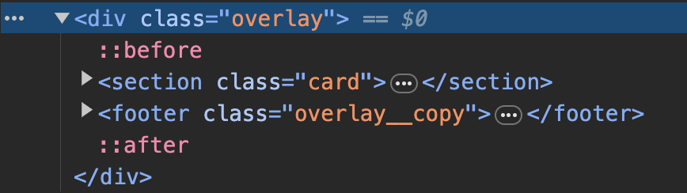

Come potete vedere nell'immagine infatti nell'inspector abbiamo :

```HTML
<div class="overlay">
  ::before
  <section class="card">
  </section>

  <footer class="overlay__copy">
  </footer>
  ::after
</div>
```

Ecco il codice completo delle due sfere.

```CSS
.overlay::before {
  content: '';
  display: block;
  position: absolute;
  z-index: 0;
  inset-block-start: 15%;
  inset-inline-start:  17%;
  inline-size: 25vw;
  block-size: 25vw;
  border-radius: 100%;
  background: var(--overlayBeforeBg);
}
.overlay::after {
  content: '';
  display: block;
  position: absolute;
  z-index: 0;
  inset-block-end:  25%;
  inset-inline-end:  30%;
  inline-size: 10vw;
  block-size: 10vw;
  border-radius: 100%;
  background: var(--overlayAfterBg);
}
```

Analizziamo le nuove proprietà.

```CSS
.overlay::after {
  content: '';
  display: block;
}
```
Queste due regole ci servono per visualizzare l'elemento generato, il `content` può essere anche vuoto, ma dobbiamo esplicitarlo, il `display` anche, altrimenti l'elemento non si visualizzerà.

Nel nostro caso non è necessario inserire il display, perché nel momento in cui usiamo `position: absolute` l'elemento diventa automaticamente un block.

Se guardiamo infatti le propietà computed vedremo che `display: block` ha un colore desaturato, questo identifica una regola ereditata.


#### Inset posizioniamo gli elementi in maniera "logica".

Analizziamo le regole successive
```CSS
{
 position: absolute;
 z-index: 0;
 inset-block-start: 15%;
 inset-inline-start:  17%;
}
```

Abbiamo un `position absolute` ed uno `z-index`, ci stiamo posizionato relativamente a `.overlay` che ha infatti un `position: relative`.

Poi abbiamo due nuove regole.
`inset-block-start`, `inset-inline-start`.

La regola `inset` è una shorthand di `top right bottom left`.

```CSS
{
  inset: 2.4rem 3rem 3rem 3rem; /* top right bottom left */
}
```
Partendo da questa shorthand, le logical properties hanno aggiunto delle desinenze che indicano se stiamo lavorando in block o inline, start o end (che sono identici ai posizionamenti di Flex e Grid).

`inset-block-start` che sta per `top`
`inset-block-end` che sta per `bottom`
`inset-inline-start` che sta per `left`
`inset-inline-end` che sta per `right`

*Con queste regole cambiando la direzione di lettura i nostri posizionamenti si comportano di conseguenza.*

### 3. Linear e radial gradient
E passiamo ora alla magia del colore.

Per l'overlay abbiamo una sfumatura lineare.

```CSS
:root {
 --overlayBg: linear-gradient(-140deg, 
                           rgb(74 16 74), 
                           rgb(13 1 43) 80%, 
                           rgb(53 21 53)); 
}
```

Analizziamo la funzione `linear-gradient()`
Il primo parametro è la direzione, nel nostro caso `-140deg`, dal secondo in poi inseriamo i nostri colori.
Se inseriamo accanto al colore dei numeri stiamo esplicitando la posizione da cui parte e finisce.

Guardiamo sempre nell'ispector come vi viene mostrato il gradiente.

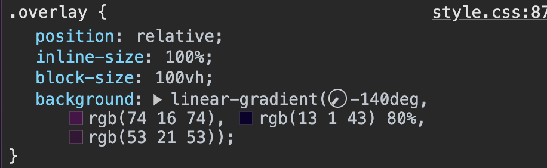

Chrome ci mostra un orologio per poter modificare l'angolo del gradiente, inoltre possiamo anche modificare i colori e il posizionamento dello stop e vedere immediatamente un risultato diverso.

Vediamo ad esempio cosa succede cancellando quel 80%.

Questa è la sfumatura originale
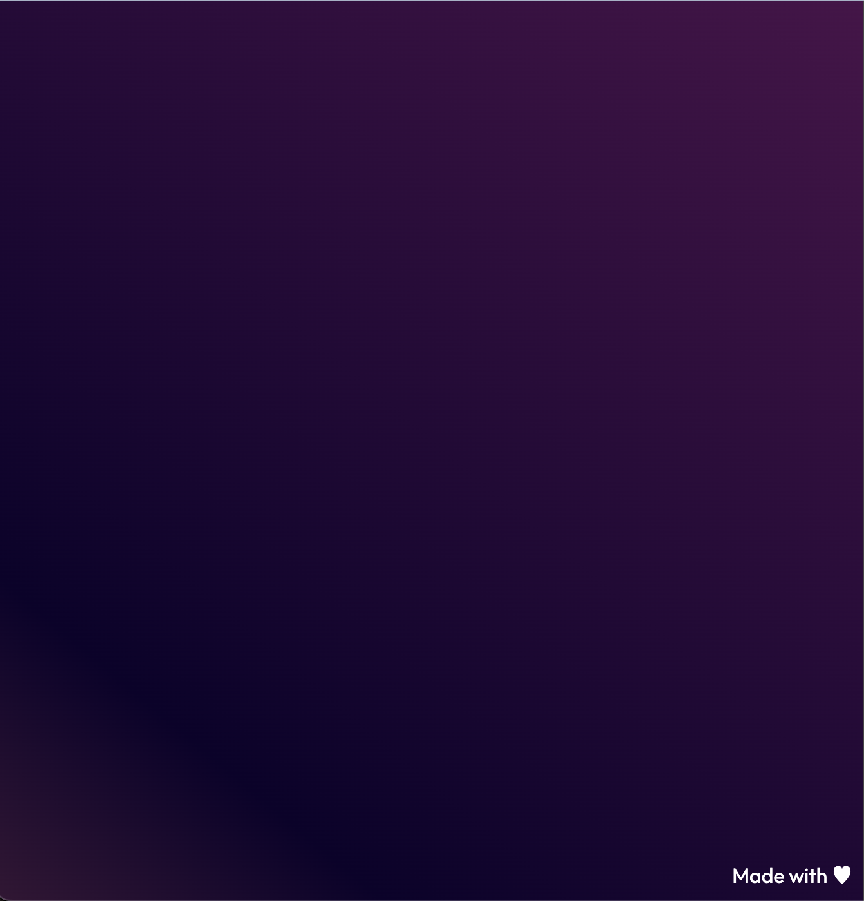

Questa quella modificata


Togliendo quel 80% i colori si sono posizionati a uguale distanza creando una sfumatura più centrata, mentre noi abbiamo la parte scura più spostata in basso a sinistra.

Diamo un'occhiata anche al magico orologio.
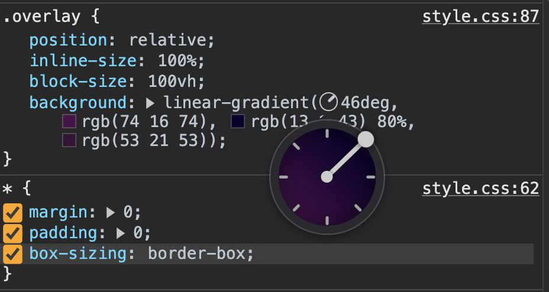

Ruotando la lancetta possiamo vedere le modifiche sia all'interno dell'orologio stesso che nella viewport.

#### Creiamo le sfere con Radial Gradient
```CSS
:root {/* circle is the shape of gradient at position left top */
  --overlayBeforeBg: radial-gradient(circle at 86% 23%,  
                                    rgb(157 68 152  / 0.9) 0%, 
                                    rgb(74 18 69 / 0.9) 30%, 
                                    rgba(22 15 56 / 0.9) 77%, 
                                    rgba(165 12 150 / 0.577) 100%);
  --overlayAfterBg: radial-gradient( circle at 95% 6%, 
                                    rgb(56 89 132 / 0.9) 0%,
                                    rgb(27 63 111  / 0.9) 30%, 
                                    rgb(11 27 48  / 0.9) 77%, 
                                    rgb(8 73 157  / 0.9) 100%);}
```

Qui le cose si fanno più intricate, ma solo all'apparenza.
Il primo parametro della funzione `radial-gradient()` è il posizionamento del centro e la forma finale `<ending-shape>`.
La forma finale default è ellittica, noi la rendiamo circolare, poi spostiamo il centro con `at 86% 23%`.
86% è la posizione da sinistra verso destra, 23% dall'alto verso il basso.
Dal secondo argomento in poi abbiamo come sempre i colori e relativi stop.
Per ottenere il giusto effetto sfera dobbiamo ricordarci di fissare un punto in cui si ha la luce più forte, che è quindi il nostro centro, e poi di inserire dal lato opposto una luce più soffusa.


La sfumatura dell'overlay ci aiuta a staccare dal fondo la sfera creando un senso di profondità.

Volete una mano con i gradienti? <br>
Esistono tanti generatori potreste provare ad esempio
[cssgradient.io](https://cssgradient.io/)

### 4. Creiamo l'effetto card traslucida.
Partiamo dalla base della card, creiamo uno sfondo con gradiente che simuli l'effetto lucido e allo stesso tempo trasparente. Poi aggiungiamo un effetto **blur**.

```SCSS
:root {
   --cardBg: linear-gradient(150deg, 
                            rgb(255 255 255 / 0.1), 
                            rgb(255 255 255 / 0.1) 2%, 
                            rgb(255 255 255 / 0.2) 3%, 
                            rgb(255 255 255 / 0.1) 4%, 
                            rgb(255 255 255 / 0.1) 12%, 
                            rgb(255 255 255 / 0.2) 23%, 
                            rgb(255 255 255 / 0.1) 25%, 
                            rgb(255 255 255 / 0.1) 94%, 
                            rgb(255 255 255 / 0.2) 95%, 
                            rgb(255 255 255 / 0.1) 96%);
}
```
Abbiamo un gradiente lineare con grado 150deg, tutti i colori `rgb` hanno una opacità, il numero dopo lo `/`.

Come detto poco fa le percentuali rapresentano la posizione degli stop. 

Qui per creare l'efferro lucido è necessario creare degli stop vicini. Creiamo l'effetto più luminoso in alto a sinistra in modo da far risaltare la card sul fondo scuro e lasciando gli input ben visibili.

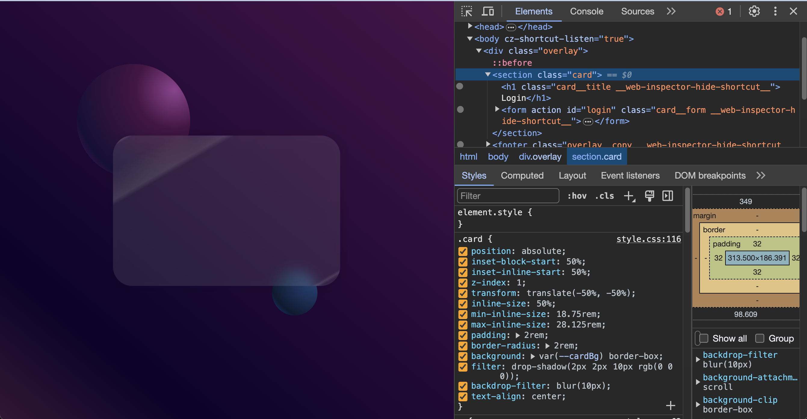

```SCSS
.card {
  position: absolute;
  inset-block-start: 50%;
  inset-inline-start:  50%;
  z-index: 1;
  transform: translate(-50%, -50%);
  inline-size: 50%;
  min-inline-size: 18.75rem; //esistono ovviamente anche min e max size
  max-inline-size: 28.125rem;
  padding: 2rem;
  border-radius: 2rem;
  background: var(--cardBg) border-box; 
  filter: drop-shadow(2px 2px 10px rgb(0 0 0));
  backdrop-filter: blur(10px);
  text-align: center;
}
```

La regola `filter: drop-shadow(2px 2px 10px rgb(0 0 0));` crea un'ombra sotto la card.
Mentre `backdrop-filter: blur(10px);` crea l'effetto blur sugli elementi che si trovano dietro la card.

Per rendere l'effetto più realistico dobbiamo inserire un riflesso più chiaro attorno alla card e un semplice `border` non andrebbe bene, poiché abbiamo bisogno di una sfumatura che a destra in basso tenda al bianco e a sinistra in alto al porpora.

**Qui dobbiamo essere creativi!**

Questo è il codice di base, un `before` con posizionamento assoluto e `z-index: -1` che lo porta dietro `.card`, un `padding` di `2px` che ci serve per renderlo più grande e una sfumatura lineare.

```CSS
.card::before {
  content: '';
  position: absolute;
  z-index: -1;
  inset: 0;
  padding: 2px; 
  background: var(--cardBeforeBG); 
  border-radius: 2rem; 
}
```

```CSS
:root {
  --cardBeforeBG: linear-gradient(-45deg,
                                  rgb(255 255 255 / 0.2) 5%, 
                                  rgb(255 255 255 / 0.2) 30%,
                                  rgb(193 73 197 / 0.2));
```

Ecco il risultato: 


Adesso abbiamo bisogno ora di eliminare la parte centrale.
Useremo le proprietà `mask`, `mask-composite`.

`Mask` ci consente di inserire un elemento che faccia da maschera al nostro `::before` nascondendone un pezzo. Questa proprietà accetta come valori immagini, svg e anche gradienti. 
Nel nostro caso usiamo 2 gradienti con clip diverse.

```CSS
{
  mask-image: linear-gradient(#fff 0 0), linear-gradient(#fff 0 0);
  mask-clip: padding-box, content-box;
  -webkit-mask-image: linear-gradient(#fff 0 0), linear-gradient(#fff 0 0);
  -webkit-mask-clip: padding-box, content-box;
}
```

Utilizzando questi due mask clip una sull'altra, la prima sfumatura inizia dal bordo del content.


Mentre la seconda dal bordo del padding.
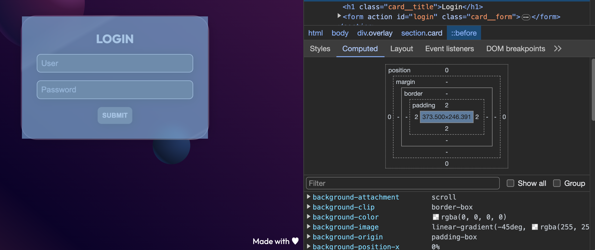


> content-box: The painted content is clipped to the content box.

> padding-box: The painted content is clipped to the padding box.

A questi aggiungiamo anche `mask-composite`

```CSS
{
  mask-composite: exclude;  
  -webkit-mask-composite: xor;
}
```
Mask composite stabilisce il modo in cui gli elementi sovrapposti si comportano, nel nostro caso vogliamo che si escludano a vicenda.

Inseriamo mask-image e mask-clip in una sola custom property usando la shorthand.

```CSS
:root {
  /* first gradient mask source and second gradient mask destination  */
  --cardMask: linear-gradient(white 0 0) padding-box, 
              linear-gradient(white 0 0) content-box;
}

Ecco il codice completo

```CSS
.card::before {
  content: '';
  position: absolute;
  z-index: -1;
  inset: 0;
  padding: 2px; 
  background: var(--cardBeforeBG); 
  border-radius: 2rem; 
  mask: var(--cardMask);
  mask-composite: exclude;  
  /* chrome */
  -webkit-mask: var(--cardMask);
  -webkit-mask-composite: xor;
}
```


[CSS Mask examples](https://www.w3schools.com/css/css3_masking.asp)
[CSS Mask reference](https://developer.mozilla.org/en-US/docs/Web/CSS/mask)
[CSS Mask Composite reference](https://developer.mozilla.org/en-US/docs/Web/CSS/-webkit-mask-composite )

### 6. Stati degli input 
Passiamo infine agli input!
 
```SCSS
.card__form .row {
  position: relative; 
  margin-block-end: 1rem;
  font-size: 1.5rem;
}

.card__form input {
  inline-size: 100%;
  padding-inline: 0.5rem;
  border: var(--inputBorder);
  border-radius: 0.5rem;
  background-color: var(--inputBg);
  line-height: 2.2rem;
  font-size: 1rem;  
  transition: padding 0.2s;
}
.card__form input::placeholder {
  color: var(--inputColor);
}
```
Impostiamo relative per posizionare la `label` in maniera assoluta e nell'input una transition che servirà per ingrandirlo alla comparsa della label.

Coloriamo il `placeholder` utilizzando un altro pseudo-selettore `::placeholder`.

Quando entriamo in focus vogliamo aumentare il padding per fare posto alla label, inoltre vogliamo che questa dimensione rimanga attiva, come pure le label quando abbiamo inserito del testo nell'input.

```CSS
.card__form input:focus, 
.card__form input:not(:placeholder-shown) {
  padding-block: 0.8rem 0.1rem;
  outline: none;
}
.card__form input:focus{
  border: 2px solid var(--inputBorderFocus);
}
.card__form input:focus::placeholder {
  color: transparent;
}
@media screen and (prefers-color-scheme: light) {
  .card__form input:focus {
    outline: 2px solid var(--inputBoxFocus);
    outline-offset: -4px;
  }
}
```
Per ottenere questo risultato usiamo la selezione `:not(:placeholder-shown)` ovvero tutti gli input che non hanno il placeholder visibile.

Se siamo in focus rendiamo i placeholder trasparenti, dato che sarà visibile la label.
Aggiungiamo infine per la preferenza schema light un focus differente sull'input.
Poiché abbiamo come background il bianco, per rendere sufficientemente contrastato il bordo del focus ricreiamo un doppio bordo, bianco e blue. <br>
`outline` ci serve per creare una linea blue e `outline-offset` crea uno spazio tra questa linea e il vero bordo.
Ecco il risultato


```CSS
.card__form label {
  position: absolute;
  display: none;
  font-size: 0.9rem;
  color: var(--labelColor);
}
.card__form input:focus + label,
.card__form input:not(:placeholder-shown) + label {
  display: block;
  inset-block-start: 0.3rem;
  inset-inline-start:  0.5rem; 
  font-weight: var(--labelFontWeight);
  letter-spacing: var(--labelLetterSpacing);
  animation-name: labelAnimation;
  animation-duration: 0.5s;
  animation-iteration-count: 1;
}
```

Per poter animare la label usiamo un `position: absolute` e quando siamo in focus sull'input aggiungiamo una `animation` che una volta terminata deve far rimanere l'ultimo stato attivo anche quando non c'è più un placeholder visibile.

```CSS
.card__form input:focus + label,
.card__form input:not(:placeholder-shown) + label 
```

L'operatore `+` ci consente di partire dall'input focus e selezionare la label successiva.
L'animation porta il posizionamento dal centro dell'input in alto e cambia il display da none a block.

```CSS
@keyframes labelAnimation {
  0% {
    display: none;
    inset-block-start: 50%;
    transform: translate-Y(-50%);
  }
  100% {
    display: block;
    inset-block-start: 0.3rem;
    transform: translate-Y(0);
  } 
}
```

### 7. Prefers reduced motion
Come sappiamo le animazioni veloci posso creare problemi gravi in alcune persone, ed è possibile quindi da SO inserire una preferenza per la riduzione della velocità delle animazioni.
Possiamo intercettare questa preferenza sempre con una mediaquery e aumentare la durata dell'animazione.

```CSS
@media screen and (prefers-reduced-motion: reduce) {
  .card__form input:focus + label,
  .card__form input:not(:placeholder-shown) + label {
    animation-duration: 1.5s;
  }
}
```
### 8. Bottone e footer
Rimangono per ultimi il button con stati hover e focus e il footer.

```CSS
.card__form .btn {
  padding-inline: 0.5rem;
  /* without border we have a layout shift */
  border: 1px solid transparent; 
  border-radius: 0.5rem;
  line-height: 2rem;
  font-weight: bold;
  text-transform: uppercase;
  cursor: pointer;
}
.card__form .btn:hover, 
.card__form .btn:focus {
  background-color: var(--btnHoverBg);
  border: 1px solid var(--btnBorderHover);
  outline: none;
  color: var(--btnColor);
}
```
Sul bottone dobbiamo ricordare di inserire un bordo trasparente della stessa dimensione del bordo colorato per evitare che il pulsante cresca quando andiamo in hover creando un layout shift!

### Conclusioni
In questo articolo abbiamo visto come utilizzare diverse proprietà avanzate di CSS per realizzare un layout semplice in termini di HTML, ma complesso come effetti visivi.
Alcune regole viste non sono completamente supportate dai browser, quindi prima di utilizzarle controllate su [Can I Use](https://caniuse.com/) l'effettiva copertura nei vari browser.

Se avete domande o richieste per futuri argomenti, lasciate un commento o inviatemi un messaggio!

Articolo pubblicato su:
[Medium](https://medium.com/@chiarapassaro/css-advanced-glassmorphism-login-64faccc30184)